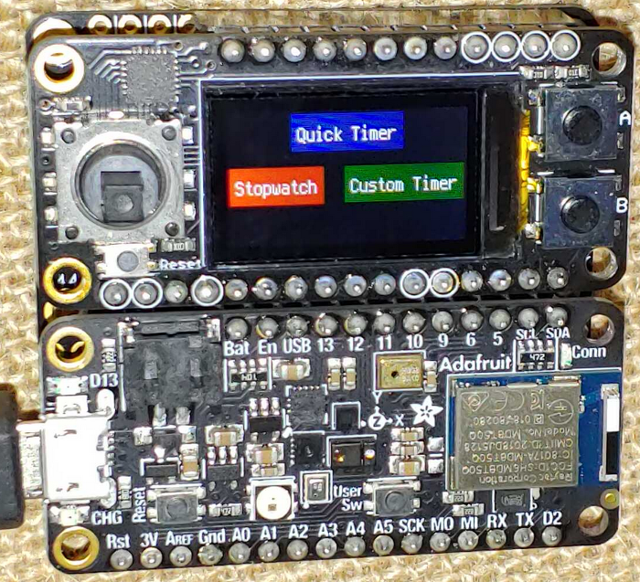

# CircuitPython Minitft Featherwing Timer Gadget
This project uses the Minitft Featherwing for various timers and stopwatches. 

[Short Demo Video](https://youtu.be/4jgLDn4JhIM)

This application requires these libraries:
- adafruit_featherwing
- adafruit_display_text
- [display_layouts](https://github.com/FoamyGuy/circuitpython_display_layouts)

